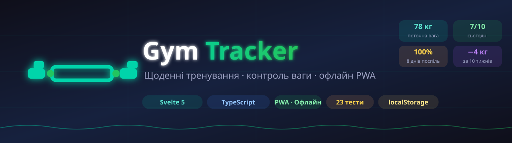
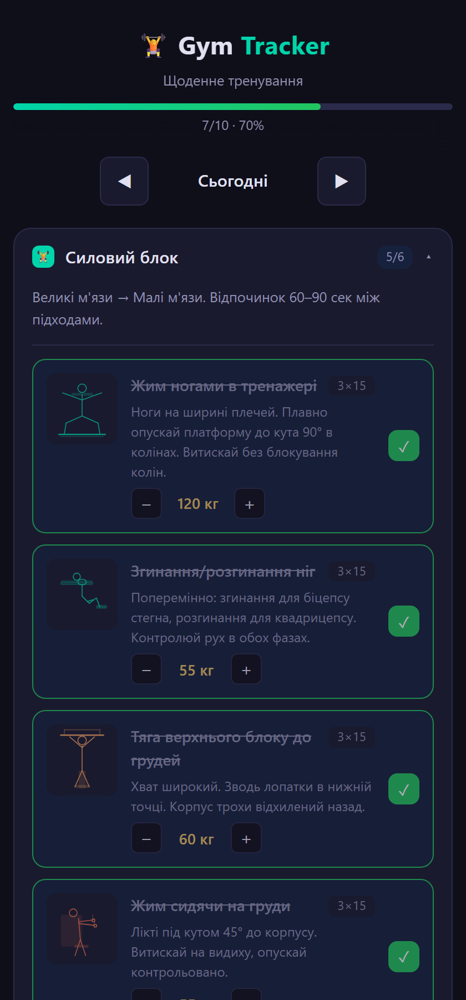
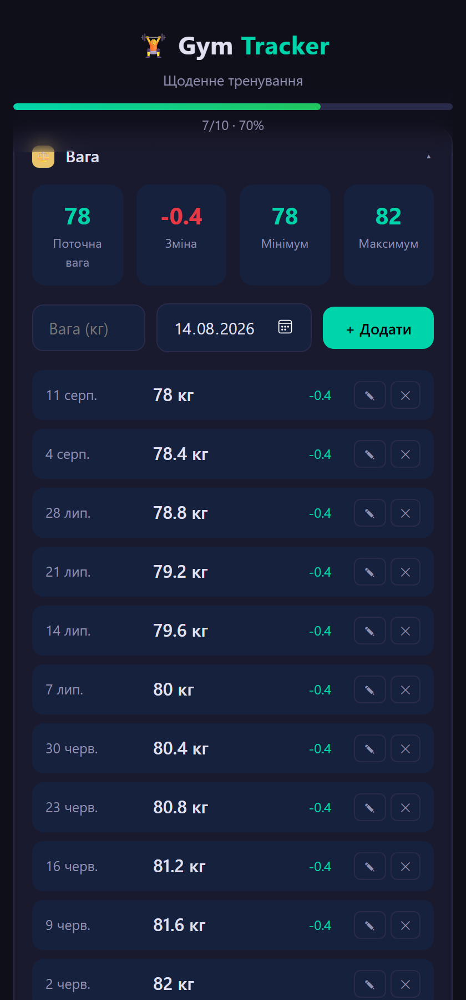
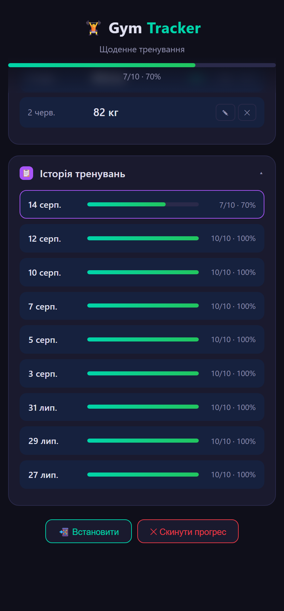

<div align="center">

# Gym Tracker — Source Code

> **Це приватний репозиторій з вихідним кодом Gym workout tracker PWA.**
> Готовий застосунок хоститься з публічного репозиторію артефактів:
> **https://ajjs1ajjs.github.io/dist/gym/**

# Gym Tracker

### Offline-first workout and body progress tracker

<p align="center">
  
</p>

Приватний PWA-застосунок для тренувань у залі. Ведення ваг, плани тренувань та заміри тіла. Працює офлайн і встановлюється на телефон як звичайний застосунок.

<p align="center">
  
  
  
  
  
</p>

[**🌐 Live Site**](https://ajjs1ajjs.github.io/dist/gym/)

</div>
---

## 🖼️ Screenshots

<p align="center">
  
  
  
</p>

---

## ✨ Features

- 💪 Ведення планів тренувань
- 📊 Графіки ваги та зміни тіла
- 🏋️ Заміри тіла + фото тіла
- 🔒 Офлайн-режим — застосунок працює без інтернету (PWA)
- 💾 Локальне зберігання даних у `localStorage` (оновлення у v2)
- 📱 Встановлення на телефон та планшет як рідний застосунок

## Структура тренувань

| День | Фокус |
|------|-------|
| **Верхня частина тіла** | Груди, біцепси/трицепси, плечі, спина, жим, тяга |
| **Нижня частина тіла** | Ноги (3–4×10) |
| **М'язи для тіла** | Ноги (3×20), ягодиці (3×45–60с) |
| **Тіло** | Прес та розтяжка (20–30 хв, пульс 110–130) |

## Технології

- **Svelte 5** — реактивність із мінімальним DOM, без runtime-бібліотек
- **TypeScript** — повна типізація
- **Vite** — швидкий білд, максимальна швидкість
- **vite-plugin-pwa** — автоматичний service worker (precache + cache-first)
- **Vitest** + **@testing-library/svelte** — 29 тестів
- **ESLint** + **svelte-check** — якість коду

## 🚀 Getting started

Користувачам достатньо відкрити **[живий застосунок](https://ajjs1ajjs.github.io/dist/gym/)** —
він працює офлайн і встановлюється на телефон як PWA.

Для локальної розробки (Node.js 22):

```bash
npm ci             # встановлення залежностей із lockfile
npm run dev        # dev-сервер (Vite, http://localhost:5173)
npm test           # тести
npm run check      # type-check (svelte-check)
npm run lint       # eslint
npm run build      # продакшн-білд у dist/
npm run preview    # перегляд білд-результату
```

## Деплой

Кодовий репозиторій приватний; публічний артефакт — зібрана PWA в
[`ajjs1ajjs/dist`](https://github.com/ajjs1ajjs/dist) (тека `gym/`), яку віддає GitHub Pages:
**https://ajjs1ajjs.github.io/dist/gym/**. CI немає — тести й збірка виконуються локально
(`npm test`, `npm run build`), зібране публікується вручну.

## Посилання

Жива версія: [https://ajjs1ajjs.github.io/dist/gym/](https://ajjs1ajjs.github.io/dist/gym/)

## Історія версій

Див. [CHANGELOG.md](CHANGELOG.md).
